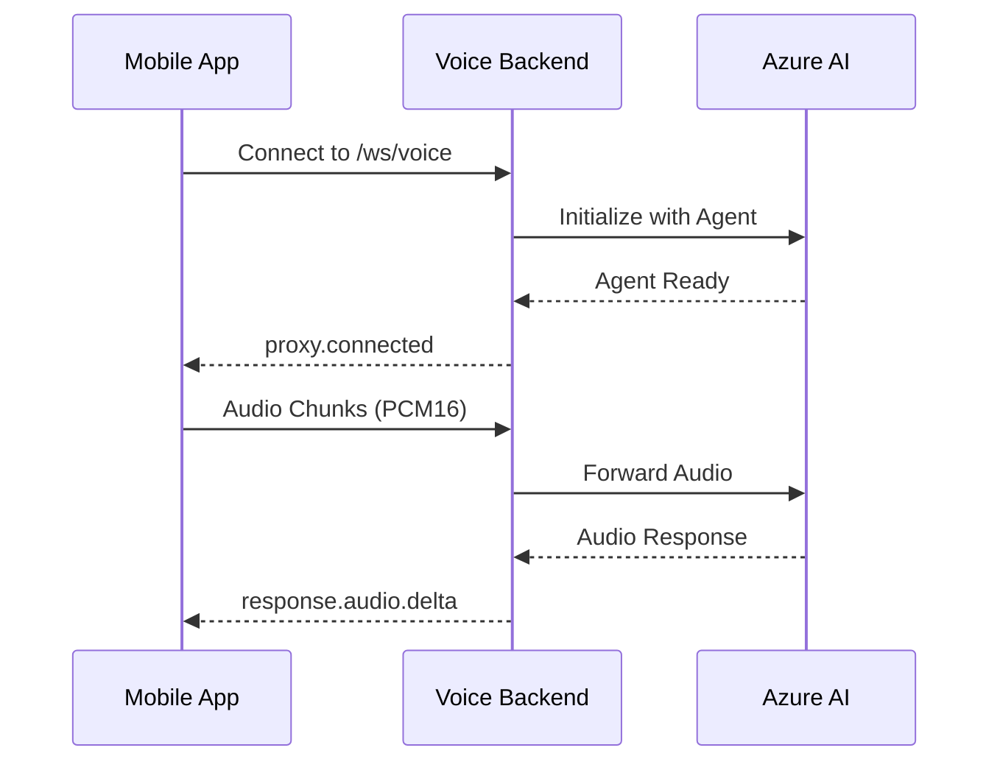

# NBK Banking Voice Backend - Complete Deployment Guide

## 🎯 Overview

This guide provides step-by-step instructions to deploy the mobile backend and integrate it with your mobile/frontend application.

---

## 📋 Prerequisites

- Azure CLI installed and authenticated
- Azure Developer CLI (azd) installed
- Git installed
- Azure subscription with permissions to create resources

---

## 🚀 Part 1: Deploy Backend to Azure

### Step 1: Clone Repository and Checkout Branch

```bash
git clone https://github.com/cyrilbouharb/NBK-Avatar-POC.git
cd NBK-Avatar-POC/voicelive-api-salescoach
git checkout mobile-backend-only
```

### Step 2: Authenticate with Azure

```bash
# Login to Azure CLI
az login

# Login to Azure Developer CLI
azd auth login
```

### Step 3: Deploy Infrastructure and Backend

```bash
# Deploy everything (takes ~15-20 minutes)
azd up
```

This will:
- ✅ Create Resource Group
- ✅ Deploy Azure OpenAI (GPT-4o)
- ✅ Deploy Azure Speech Services
- ✅ Create Container Registry
- ✅ Build and push Docker image
- ✅ Create Container App with backend
- ✅ Configure all environment variables

### Step 4: Get Your WebSocket Endpoint

After deployment completes:

**PowerShell:**
```powershell
$SERVICE_URL = (azd env get-value SERVICE_VOICELAB_URI) -replace 'https://', ''
Write-Host "WebSocket Endpoint: wss://$SERVICE_URL/ws/voice"
Write-Host "Health Check: https://$SERVICE_URL/api/health"
```

**Bash:**
```bash
SERVICE_URL=$(azd env get-value SERVICE_VOICELAB_URI | sed 's|https://||')
echo "WebSocket Endpoint: wss://$SERVICE_URL/ws/voice"
echo "Health Check: https://$SERVICE_URL/api/health"
```

**Example Output:**
```
WebSocket Endpoint: wss://voicelab.orangepebble-97f068fa.eastus2.azurecontainerapps.io/ws/voice
Health Check: https://voicelab.orangepebble-97f068fa.eastus2.azurecontainerapps.io/api/health
```

### Step 5: Verify Deployment

Test the health endpoint:

```bash
curl https://voicelab.orangepebble-97f068fa.eastus2.azurecontainerapps.io/api/health
```

Expected response:
```json
{
  "status": "healthy",
  "service": "NBK Banking Voice Backend",
  "websocket_endpoint": "/ws/voice"
}
```

---

## 🤖 Part 2: Create and Configure Azure AI Agent

### Step 1: Create Agent in Azure AI Foundry

1. Go to [Azure AI Foundry Portal](https://ai.azure.com)
2. Select your AI Services resource (created by azd)
3. Navigate to **Agents** → **Create Agent**
4. Configure:
   - **Name**: `NBK Banking Customer Service`
   - **Model**: Select `gpt-4o` (already deployed)
   - **Instructions**: Paste the following:

```text
CRITICAL INTERACTION GUIDELINES FOR NBK BANKING CUSTOMER SERVICE:
- You are a helpful and professional NBK (National Bank of Kuwait) customer service representative
- Keep responses SHORT and conversational (3-4 sentences max, as if speaking on phone)
- Provide accurate information about NBK banking services, products, and policies
- Be courteous, patient, and empathetic with customers
- Use natural speech patterns appropriate for customer service
- Always prioritize customer security and privacy
- If you don't know specific account details, guide customers to secure channels
- Speak naturally in either Arabic or English based on customer's language preference
- For Arabic speakers, use clear Modern Standard Arabic that's accessible to Kuwaiti dialect speakers
- Show genuine care and professionalism in every interaction
```

5. **Save** the agent
6. **Copy the Agent ID** (format: `asst_xxxxxxxxxxxxxxxxxxxxx`)
7. **Copy the Project Name** (visible at top of portal or in URL: `https://ai.azure.com/projects/<project-name>/...`)

### Step 2: Configure Backend with Agent ID and Project Name

**PowerShell (multi-line):**
```powershell
# Get deployment info
$APP_NAME = azd env get-value AZURE_CONTAINER_APP_NAME
$RESOURCE_GROUP = azd env get-value AZURE_RESOURCE_GROUP
$AGENT_ID = "asst_xxxxxxxxxxxxx"  # REPLACE with your Agent ID
$PROJECT_NAME = "your-project-name"  # REPLACE with your AI Foundry Project name

# Update Container App
az containerapp update `
  --name $APP_NAME `
  --resource-group $RESOURCE_GROUP `
  --set-env-vars "AGENT_ID=$AGENT_ID" "AZURE_AI_PROJECT_NAME=$PROJECT_NAME" "USE_AZURE_AI_AGENTS=true"
```

**PowerShell (single-line):**
```powershell
$APP_NAME = azd env get-value AZURE_CONTAINER_APP_NAME; $RESOURCE_GROUP = azd env get-value AZURE_RESOURCE_GROUP; $AGENT_ID = "asst_xxxxxxxxxxxxx"; $PROJECT_NAME = "your-project-name"; az containerapp update --name $APP_NAME --resource-group $RESOURCE_GROUP --set-env-vars "AGENT_ID=$AGENT_ID" "AZURE_AI_PROJECT_NAME=$PROJECT_NAME" "USE_AZURE_AI_AGENTS=true"
```

**Bash/Linux (multi-line):**
```bash
# Get deployment info
APP_NAME=$(azd env get-value AZURE_CONTAINER_APP_NAME)
RESOURCE_GROUP=$(azd env get-value AZURE_RESOURCE_GROUP)
AGENT_ID="asst_xxxxxxxxxxxxx"  # REPLACE with your Agent ID
PROJECT_NAME="your-project-name"  # REPLACE with your AI Foundry Project name

# Update Container App
az containerapp update \
  --name "$APP_NAME" \
  --resource-group "$RESOURCE_GROUP" \
  --set-env-vars "AGENT_ID=$AGENT_ID" "AZURE_AI_PROJECT_NAME=$PROJECT_NAME" "USE_AZURE_AI_AGENTS=true"
```

**Bash/Linux (single-line):**
```bash
APP_NAME=$(azd env get-value AZURE_CONTAINER_APP_NAME) && RESOURCE_GROUP=$(azd env get-value AZURE_RESOURCE_GROUP) && AGENT_ID="asst_xxxxxxxxxxxxx" && PROJECT_NAME="your-project-name" && az containerapp update --name "$APP_NAME" --resource-group "$RESOURCE_GROUP" --set-env-vars "AGENT_ID=$AGENT_ID" "AZURE_AI_PROJECT_NAME=$PROJECT_NAME" "USE_AZURE_AI_AGENTS=true"
```

### Step 3: Verify Agent Configuration

```bash
# Check environment variables
az containerapp show \
  --name "$APP_NAME" \
  --resource-group "$RESOURCE_GROUP" \
  --query "properties.template.containers[0].env" \
  --output table
```

Look for:
- `AGENT_ID`: Your agent ID should be displayed
- `AZURE_AI_PROJECT_NAME`: Your project name should be displayed
- `USE_AZURE_AI_AGENTS`: Should be `true`

---

## 📱 Part 3: Frontend/Mobile Integration

### WebSocket Endpoint

Your mobile/frontend application connects to:

```
wss://voicelab.orangepebble-97f068fa.eastus2.azurecontainerapps.io/ws/voice
```

**Replace with your actual URL from Step 4 above.**

### Available Endpoints

| Endpoint | Method | Purpose |
|----------|--------|---------|
| `/ws/voice` | WebSocket | Real-time voice conversation |
| `/api/health` | GET | Health check |
| `/api/config` | GET | Get configuration |

---

## 🔌 WebSocket Integration Guide

### Connection Flow



### Message Types

#### 1. Connection Confirmation (Backend → Mobile)

Sent immediately after connection:

```json
{
  "type": "proxy.connected",
  "message": "Connected to Azure Voice API"
}
```

#### 2. Send Audio (Mobile → Backend)

Stream audio in real-time:

```json
{
  "type": "input_audio_buffer.append",
  "audio": "<base64-encoded-pcm16-audio>"
}
```

**Audio Requirements:**
- Format: PCM16 (16-bit linear PCM)
- Sample Rate: 24000 Hz (24 kHz)
- Channels: Mono
- Encoding: Base64

#### 3. Commit Audio (Mobile → Backend)

Signal end of user's speech:

```json
{
  "type": "input_audio_buffer.commit"
}
```

#### 4. Receive Audio (Backend → Mobile)

Real-time audio response:

```json
{
  "type": "response.audio.delta",
  "delta": "<base64-encoded-pcm16-audio>",
  "response_id": "resp_xxx",
  "item_id": "item_xxx"
}
```

**Action**: Decode base64 and play audio immediately.

#### 5. User Transcript (Backend → Mobile)

What the user said:

```json
{
  "type": "conversation.item.input_audio_transcription.completed",
  "item_id": "item_xxx",
  "transcript": "I would like to know about savings accounts"
}
```

#### 6. Assistant Transcript (Backend → Mobile)

What the AI assistant said:

```json
{
  "type": "response.audio_transcript.done",
  "response_id": "resp_xxx",
  "item_id": "item_xxx",
  "transcript": "I'd be happy to help you learn about NBK's savings accounts..."
}
```

#### 7. Error (Backend → Mobile)

Error notifications:

```json
{
  "type": "error",
  "error": {
    "message": "Error description"
  }
}
```

---

## 💻 Sample Integration Code

### JavaScript/TypeScript Example

```typescript
// Connect to WebSocket
const ws = new WebSocket('wss://voicelab.orangepebble-97f068fa.eastus2.azurecontainerapps.io/ws/voice');

ws.onopen = () => {
  console.log('✅ Connected to NBK Voice Backend');
};

ws.onmessage = (event) => {
  const message = JSON.parse(event.data);
  
  switch (message.type) {
    case 'proxy.connected':
      console.log('✅ Proxy connected to Azure');
      break;
      
    case 'response.audio.delta':
      // Decode and play audio
      const audioData = atob(message.delta);
      playAudio(audioData);
      break;
      
    case 'conversation.item.input_audio_transcription.completed':
      console.log('User:', message.transcript);
      break;
      
    case 'response.audio_transcript.done':
      console.log('Assistant:', message.transcript);
      break;
      
    case 'error':
      console.error('Error:', message.error.message);
      break;
  }
};

// Send audio chunk
function sendAudio(audioBuffer) {
  const base64Audio = btoa(
    String.fromCharCode(...new Uint8Array(audioBuffer))
  );
  
  ws.send(JSON.stringify({
    type: 'input_audio_buffer.append',
    audio: base64Audio
  }));
}

// Commit audio (end of user speech)
function commitAudio() {
  ws.send(JSON.stringify({
    type: 'input_audio_buffer.commit'
  }));
}
```

### iOS Swift Example

```swift
import Foundation

class NBKVoiceClient {
    private var webSocket: URLSessionWebSocketTask?
    
    func connect() {
        let url = URL(string: "wss://voicelab.orangepebble-97f068fa.eastus2.azurecontainerapps.io/ws/voice")!
        webSocket = URLSession.shared.webSocketTask(with: url)
        webSocket?.resume()
        receiveMessage()
    }
    
    func sendAudio(audioData: Data) {
        let base64Audio = audioData.base64EncodedString()
        let message: [String: Any] = [
            "type": "input_audio_buffer.append",
            "audio": base64Audio
        ]
        
        let jsonData = try! JSONSerialization.data(withJSONObject: message)
        let jsonString = String(data: jsonData, encoding: .utf8)!
        
        webSocket?.send(.string(jsonString)) { error in
            if let error = error {
                print("Send error: \(error)")
            }
        }
    }
    
    func commitAudio() {
        let message: [String: String] = ["type": "input_audio_buffer.commit"]
        let jsonData = try! JSONSerialization.data(withJSONObject: message)
        let jsonString = String(data: jsonData, encoding: .utf8)!
        
        webSocket?.send(.string(jsonString)) { _ in }
    }
    
    private func receiveMessage() {
        webSocket?.receive { [weak self] result in
            switch result {
            case .success(let message):
                switch message {
                case .string(let text):
                    self?.handleMessage(text)
                case .data(_):
                    break
                @unknown default:
                    break
                }
                self?.receiveMessage()
            case .failure(let error):
                print("Receive error: \(error)")
            }
        }
    }
    
    private func handleMessage(_ text: String) {
        guard let data = text.data(using: .utf8),
              let json = try? JSONSerialization.jsonObject(with: data) as? [String: Any],
              let type = json["type"] as? String else {
            return
        }
        
        switch type {
        case "proxy.connected":
            print("✅ Connected")
        case "response.audio.delta":
            if let base64Audio = json["delta"] as? String,
               let audioData = Data(base64Encoded: base64Audio) {
                playAudio(audioData)
            }
        case "conversation.item.input_audio_transcription.completed":
            if let transcript = json["transcript"] as? String {
                print("User: \(transcript)")
            }
        case "response.audio_transcript.done":
            if let transcript = json["transcript"] as? String {
                print("Assistant: \(transcript)")
            }
        default:
            break
        }
    }
    
    private func playAudio(_ data: Data) {
        // Implement audio playback
    }
}
```

### Android Kotlin Example

```kotlin
import okhttp3.*
import org.json.JSONObject

class NBKVoiceClient {
    private var webSocket: WebSocket? = null
    private val client = OkHttpClient()
    
    fun connect() {
        val request = Request.Builder()
            .url("wss://voicelab.orangepebble-97f068fa.eastus2.azurecontainerapps.io/ws/voice")
            .build()
        
        webSocket = client.newWebSocket(request, object : WebSocketListener() {
            override fun onOpen(webSocket: WebSocket, response: Response) {
                println("✅ Connected")
            }
            
            override fun onMessage(webSocket: WebSocket, text: String) {
                handleMessage(text)
            }
            
            override fun onFailure(webSocket: WebSocket, t: Throwable, response: Response?) {
                println("❌ Error: ${t.message}")
            }
        })
    }
    
    fun sendAudio(audioData: ByteArray) {
        val base64Audio = android.util.Base64.encodeToString(
            audioData,
            android.util.Base64.NO_WRAP
        )
        
        val message = JSONObject().apply {
            put("type", "input_audio_buffer.append")
            put("audio", base64Audio)
        }
        
        webSocket?.send(message.toString())
    }
    
    fun commitAudio() {
        val message = JSONObject().apply {
            put("type", "input_audio_buffer.commit")
        }
        
        webSocket?.send(message.toString())
    }
    
    private fun handleMessage(text: String) {
        val json = JSONObject(text)
        val type = json.getString("type")
        
        when (type) {
            "proxy.connected" -> println("✅ Connected")
            "response.audio.delta" -> {
                val base64Audio = json.getString("delta")
                val audioData = android.util.Base64.decode(base64Audio, android.util.Base64.NO_WRAP)
                playAudio(audioData)
            }
            "conversation.item.input_audio_transcription.completed" -> {
                val transcript = json.getString("transcript")
                println("User: $transcript")
            }
            "response.audio_transcript.done" -> {
                val transcript = json.getString("transcript")
                println("Assistant: $transcript")
            }
        }
    }
    
    private fun playAudio(data: ByteArray) {
        // Implement audio playback
    }
}
```

---

## 🎙️ Audio Specifications

### Input Audio (Microphone)

| Property | Value |
|----------|-------|
| Format | PCM16 (Linear 16-bit) |
| Sample Rate | 24000 Hz (24 kHz) |
| Channels | Mono |
| Bit Depth | 16-bit |
| Encoding | Base64 |
| Chunk Size | 100-200ms recommended |

### Output Audio (Speaker)

| Property | Value |
|----------|-------|
| Format | PCM16 (Linear 16-bit) |
| Sample Rate | 24000 Hz (24 kHz) |
| Channels | Mono |
| Bit Depth | 16-bit |
| Encoding | Base64 |
| Latency | ~100-300ms |

---

## 🔒 Security

- ✅ All connections use **WSS** (secure WebSocket)
- ✅ Azure API keys stay in backend, never exposed to clients
- ✅ HTTPS health/config endpoints
- ❌ Never send sensitive data (account numbers, passwords, PINs)

---

## 🐛 Troubleshooting

### Health Check Fails

**Problem**: `curl https://.../api/health` returns error

**Solutions**:
1. Verify Container App is running in Azure Portal
2. Check deployment logs: `azd monitor`
3. Ensure correct URL (remove `https://` prefix before adding `wss://`)

### WebSocket Connection Fails

**Problem**: Cannot connect to `/ws/voice`

**Solutions**:
1. Verify using `wss://` (not `ws://`)
2. Check URL format: `wss://your-domain.azurecontainerapps.io/ws/voice`
3. Test health endpoint first to confirm backend is up
4. Check firewall/network settings

### No Audio Response

**Problem**: Connected but no audio received

**Solutions**:
1. Verify `AGENT_ID` is configured in Container App
2. Check audio format is PCM16 24kHz mono
3. Ensure `input_audio_buffer.commit` was sent
4. Review Container App logs for errors

### Agent Not Responding Correctly

**Problem**: Generic responses, not NBK context, or "Missing required agent connection string" error

**Solutions**:
1. Verify agent instructions in Azure AI Foundry Portal
2. Confirm `USE_AZURE_AI_AGENTS=true` in Container App
3. Check `AGENT_ID` matches the agent you created
4. **Verify `AZURE_AI_PROJECT_NAME` is set correctly**
5. Review agent configuration in portal

---

## 📊 Monitoring

### View Backend Logs

**Azure Portal**:
1. Go to Resource Groups → Your Resource Group
2. Select the Container App
3. Navigate to **Monitoring** → **Log stream**

**Azure CLI**:
```bash
az containerapp logs show \
  --name "$APP_NAME" \
  --resource-group "$RESOURCE_GROUP" \
  --follow
```

### Application Insights

Access detailed telemetry:
1. Go to Azure Portal → Your Resource Group
2. Open Application Insights resource
3. Navigate to **Logs** or **Transaction search**

---

## 🔄 Update and Redeploy

### Update Code Only

```bash
# Make code changes
git add .
git commit -m "Your changes"
git push

# Redeploy application only (faster than full azd up)
azd deploy
```

### Update Infrastructure

```bash
# Modify bicep files
# Then redeploy everything
azd up
```

### Update Agent Configuration

**Bash:**
```bash
# No redeployment needed - just update env vars
az containerapp update \
  --name "$APP_NAME" \
  --resource-group "$RESOURCE_GROUP" \
  --set-env-vars "AGENT_ID=<new-agent-id>" "AZURE_AI_PROJECT_NAME=<project-name>"
```

**PowerShell:**
```powershell
# Single-line version
az containerapp update --name $APP_NAME --resource-group $RESOURCE_GROUP --set-env-vars "AGENT_ID=<new-agent-id>" "AZURE_AI_PROJECT_NAME=<project-name>"
```

---

## 🗑️ Cleanup

### Delete All Resources

```bash
# Delete everything
azd down --purge

# Remove local environment
azd env delete
```

---

## 📞 Support

For issues:
1. Check Container App logs
2. Review Application Insights
3. Verify all environment variables
4. Test health endpoint
5. Consult this guide and `MOBILE-INTEGRATION-GUIDE.md`

---

## ✅ Quick Reference

| Item | Value |
|------|-------|
| **WebSocket Endpoint** | `wss://voicelab.orangepebble-97f068fa.eastus2.azurecontainerapps.io/ws/voice` |
| **Health Check** | `https://voicelab.orangepebble-97f068fa.eastus2.azurecontainerapps.io/api/health` |
| **Audio Format** | PCM16, 24kHz, Mono, Base64 |
| **Languages** | English & Arabic (auto-detected) |
| **Agent Type** | Azure AI Foundry Agent |
| **Security** | WSS/HTTPS only |

---

**Deployment Complete! Share the WebSocket endpoint with your mobile/frontend team.** 🚀
