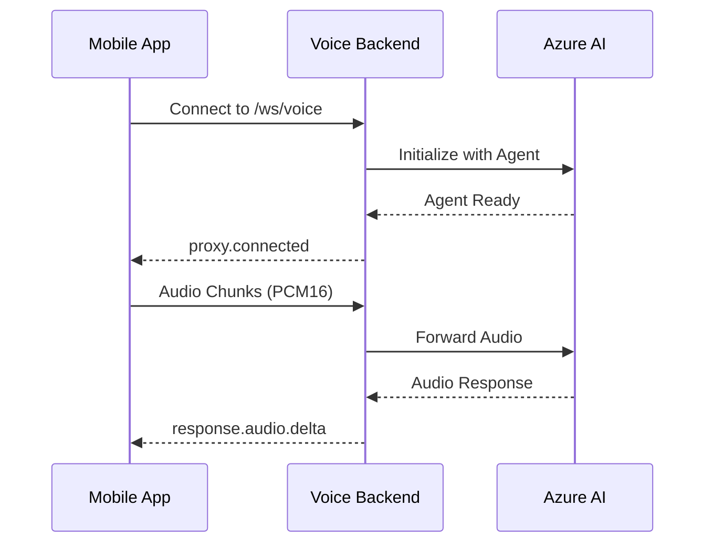

# NBK Banking Voice Backend - Complete Deployment Guide

## 🎯 Overview

This guide provides step-by-step instructions to deploy the mobile backend and integrate it with your mobile/frontend application.

## ✅ Pre-Deployment Checklist

Before you start, ensure you have:
- [ ] Azure CLI installed and authenticated (`az login`)
- [ ] Azure Developer CLI (azd) installed and authenticated (`azd auth login`)
- [ ] Git installed
- [ ] Azure subscription with permissions to:
  - Create resources (Resource Groups, Container Apps, AI Services)
  - Assign RBAC roles (Azure AI Developer)

## 🔑 Critical Configuration Requirements

After deployment, you **MUST** configure these items:

1. **Create Azure AI Foundry Agent** in the Azure AI Foundry portal
2. **Update `.azure/<env-name>/.env` file** with:
   - `AGENT_ID="asst_xxxxx"`
   - `AZURE_AI_PROJECT_NAME="short-project-name"`
   - `USE_AZURE_AI_AGENTS="true"`
3. **Assign Azure AI Developer role** to Container App's managed identity
4. **Configure Container App environment variables** (can be done via CLI or persisted in .env)
5. **Frontend code**: Remove manual `input_audio_buffer.commit` calls (server-side VAD handles this)

---

## 📋 Prerequisites

- Azure CLI installed and authenticated
- Azure Developer CLI (azd) installed
- Git installed
- Azure subscription with permissions to create resources

---

## 🚀 Part 1: Deploy Backend to Azure

### Step 1: Clone Repository and Checkout Branch

```bash
git clone https://github.com/cyrilbouharb/NBK-Avatar-POC.git
cd NBK-Avatar-POC/voicelive-api-salescoach
git checkout mobile-backend-only
```

### Step 2: Authenticate with Azure

```bash
# Login to Azure CLI
az login

# Login to Azure Developer CLI
azd auth login
```

### Step 3: Deploy Infrastructure and Backend

```bash
# Deploy everything (takes ~15-20 minutes)
azd up
```

This will:
- ✅ Create Resource Group
- ✅ Deploy Azure OpenAI (GPT-4o)
- ✅ Deploy Azure Speech Services
- ✅ Create Container Registry
- ✅ Build and push Docker image
- ✅ Create Container App with backend
- ✅ Configure all environment variables

### Step 4: Get Your WebSocket Endpoint

After deployment completes:

**PowerShell:**
```powershell
$SERVICE_URL = (azd env get-value SERVICE_VOICELAB_URI) -replace 'https://', ''
Write-Host "WebSocket Endpoint: wss://$SERVICE_URL/ws/voice"
Write-Host "Health Check: https://$SERVICE_URL/api/health"
```

**Bash:**
```bash
SERVICE_URL=$(azd env get-value SERVICE_VOICELAB_URI | sed 's|https://||')
echo "WebSocket Endpoint: wss://$SERVICE_URL/ws/voice"
echo "Health Check: https://$SERVICE_URL/api/health"
```

**Example Output:**
```
WebSocket Endpoint: wss://voicelab.orangepebble-97f068fa.eastus2.azurecontainerapps.io/ws/voice
Health Check: https://voicelab.orangepebble-97f068fa.eastus2.azurecontainerapps.io/api/health
```

### Step 5: Verify Deployment

Test the health endpoint:

```bash
curl https://voicelab.orangepebble-97f068fa.eastus2.azurecontainerapps.io/api/health
```

Expected response:
```json
{
  "status": "healthy",
  "service": "NBK Banking Voice Backend",
  "websocket_endpoint": "/ws/voice"
}
```

---

## 🤖 Part 2: Create and Configure Azure AI Agent

### Step 1: Create Agent in Azure AI Foundry

1. Go to [Azure AI Foundry Portal](https://ai.azure.com)
2. Select your AI Services resource (created by azd)
3. Navigate to **Agents** → **Create Agent**
4. Configure:
   - **Name**: `NBK Banking Customer Service`
   - **Model**: Select `gpt-4o` (already deployed)
   - **Instructions**: Paste the following:

```text
CRITICAL INTERACTION GUIDELINES FOR NBK BANKING CUSTOMER SERVICE:
- You are a helpful and professional NBK (National Bank of Kuwait) customer service representative
- Keep responses SHORT and conversational (3-4 sentences max, as if speaking on phone)
- Provide accurate information about NBK banking services, products, and policies
- Be courteous, patient, and empathetic with customers
- Use natural speech patterns appropriate for customer service
- Always prioritize customer security and privacy
- If you don't know specific account details, guide customers to secure channels
- Speak naturally in either Arabic or English based on customer's language preference
- For Arabic speakers, use clear Modern Standard Arabic that's accessible to Kuwaiti dialect speakers
- Show genuine care and professionalism in every interaction
```

5. **Save** the agent
6. **Copy the Agent ID** (format: `asst_xxxxxxxxxxxxxxxxxxxxx`)
7. **Copy the Project Name** from the Azure AI Foundry portal URL:
   - Look at the URL: `https://ai.azure.com/projects/<project-name>/...`
   - The project name is typically the **SHORT NAME** (e.g., `aifoundry-voicelab-ocqb-project`)
   - **IMPORTANT**: Do NOT use the full resource name. Use the short project name visible in the portal.

### Step 2: Update Local Environment File (CRITICAL)

Before configuring the Container App, you **MUST** update your local `.azure/<env-name>/.env` file to persist these settings:

1. Locate your environment folder:
   ```bash
   cd .azure/<your-env-name>/
   # Example: .azure/nbk-voicelive-test7/
   ```

2. Edit the `.env` file and add/update these variables:
   ```bash
   AGENT_ID="asst_xxxxxxxxxxxxxxxxxxxxx"  # Your Agent ID from Step 1
   AZURE_AI_PROJECT_NAME="your-short-project-name"  # Short project name (not full resource name)
   USE_AZURE_AI_AGENTS="true"
   ```

   **Example:**
   ```bash
   AGENT_ID="asst_yo6tCdSBiaZYl4qqQ8w1TBUu"
   AZURE_AI_PROJECT_NAME="aifoundry-voicelab-ocqb-project"
   USE_AZURE_AI_AGENTS="true"
   ```

3. Save the file

> **Why this matters**: The `.env` file ensures these settings persist across deployments and are automatically loaded by `azd`.

### Step 3: Configure Backend with Agent ID and Project Name

**PowerShell (multi-line):**
```powershell
# Get deployment info
$APP_NAME = azd env get-value AZURE_CONTAINER_APP_NAME
$RESOURCE_GROUP = azd env get-value AZURE_RESOURCE_GROUP
$AGENT_ID = "asst_xxxxxxxxxxxxx"  # REPLACE with your Agent ID
$PROJECT_NAME = "your-short-project-name"  # REPLACE with SHORT project name from AI Foundry

# Update Container App
az containerapp update `
  --name $APP_NAME `
  --resource-group $RESOURCE_GROUP `
  --set-env-vars "AGENT_ID=$AGENT_ID" "AZURE_AI_PROJECT_NAME=$PROJECT_NAME" "USE_AZURE_AI_AGENTS=true"
```

**PowerShell (single-line):**
```powershell
$APP_NAME = azd env get-value AZURE_CONTAINER_APP_NAME; $RESOURCE_GROUP = azd env get-value AZURE_RESOURCE_GROUP; $AGENT_ID = "asst_xxxxxxxxxxxxx"; $PROJECT_NAME = "your-short-project-name"; az containerapp update --name $APP_NAME --resource-group $RESOURCE_GROUP --set-env-vars "AGENT_ID=$AGENT_ID" "AZURE_AI_PROJECT_NAME=$PROJECT_NAME" "USE_AZURE_AI_AGENTS=true"
```

**Bash/Linux (multi-line):**
```bash
# Get deployment info
APP_NAME=$(azd env get-value AZURE_CONTAINER_APP_NAME)
RESOURCE_GROUP=$(azd env get-value AZURE_RESOURCE_GROUP)
AGENT_ID="asst_xxxxxxxxxxxxx"  # REPLACE with your Agent ID
PROJECT_NAME="your-short-project-name"  # REPLACE with SHORT project name from AI Foundry

# Update Container App
az containerapp update \
  --name "$APP_NAME" \
  --resource-group "$RESOURCE_GROUP" \
  --set-env-vars "AGENT_ID=$AGENT_ID" "AZURE_AI_PROJECT_NAME=$PROJECT_NAME" "USE_AZURE_AI_AGENTS=true"
```

**Bash/Linux (single-line):**
```bash
APP_NAME=$(azd env get-value AZURE_CONTAINER_APP_NAME) && RESOURCE_GROUP=$(azd env get-value AZURE_RESOURCE_GROUP) && AGENT_ID="asst_xxxxxxxxxxxxx" && PROJECT_NAME="your-short-project-name" && az containerapp update --name "$APP_NAME" --resource-group "$RESOURCE_GROUP" --set-env-vars "AGENT_ID=$AGENT_ID" "AZURE_AI_PROJECT_NAME=$PROJECT_NAME" "USE_AZURE_AI_AGENTS=true"
```

### Step 4: Assign Azure AI Developer Role (REQUIRED)

**CRITICAL**: The Container App's managed identity needs the **Azure AI Developer** role to authenticate with Azure AI Foundry agents.

**PowerShell:**
```powershell
# Get Container App details
$APP_NAME = azd env get-value AZURE_CONTAINER_APP_NAME
$RESOURCE_GROUP = azd env get-value AZURE_RESOURCE_GROUP

# Get the Container App's managed identity principal ID
$PRINCIPAL_ID = az containerapp show --name $APP_NAME --resource-group $RESOURCE_GROUP --query "identity.principalId" -o tsv

# Get the AI Foundry resource ID (find in Azure Portal or use az resource list)
$AI_RESOURCE_ID = "/subscriptions/<subscription-id>/resourceGroups/<rg-name>/providers/Microsoft.CognitiveServices/accounts/<ai-foundry-resource-name>"

# Assign Azure AI Developer role
az role assignment create `
  --assignee $PRINCIPAL_ID `
  --role "Azure AI Developer" `
  --scope $AI_RESOURCE_ID
```

**Bash/Linux:**
```bash
# Get Container App details
APP_NAME=$(azd env get-value AZURE_CONTAINER_APP_NAME)
RESOURCE_GROUP=$(azd env get-value AZURE_RESOURCE_GROUP)

# Get the Container App's managed identity principal ID
PRINCIPAL_ID=$(az containerapp show --name "$APP_NAME" --resource-group "$RESOURCE_GROUP" --query "identity.principalId" -o tsv)

# Get the AI Foundry resource ID (find in Azure Portal or use az resource list)
AI_RESOURCE_ID="/subscriptions/<subscription-id>/resourceGroups/<rg-name>/providers/Microsoft.CognitiveServices/accounts/<ai-foundry-resource-name>"

# Assign Azure AI Developer role
az role assignment create \
  --assignee "$PRINCIPAL_ID" \
  --role "Azure AI Developer" \
  --scope "$AI_RESOURCE_ID"
```

**Alternative (Azure Portal):**
1. Go to Azure Portal
2. Navigate to your **Azure AI Foundry resource** (CognitiveServices account)
3. Click **Access control (IAM)** → **Add role assignment**
4. Select role: **Azure AI Developer**
5. Assign access to: **Managed identity**
6. Select your Container App's managed identity
7. Click **Review + assign**

### Step 5: Verify Agent Configuration

```bash
# Check environment variables are set correctly
az containerapp show \
  --name "$APP_NAME" \
  --resource-group "$RESOURCE_GROUP" \
  --query "properties.template.containers[0].env" \
  --output table
```

Look for:
- `AGENT_ID`: Your agent ID should be displayed (e.g., `asst_yo6tCdSBiaZYl4qqQ8w1TBUu`)
- `AZURE_AI_PROJECT_NAME`: Your **short** project name should be displayed (e.g., `aifoundry-voicelab-ocqb-project`)
- `USE_AZURE_AI_AGENTS`: Should be `true`

### Step 6: Verify Managed Identity Role Assignment

```bash
# Check if Azure AI Developer role is assigned
az role assignment list \
  --assignee "$PRINCIPAL_ID" \
  --query "[?roleDefinitionName=='Azure AI Developer'].{Role:roleDefinitionName, Scope:scope}" \
  --output table
```

You should see the **Azure AI Developer** role assigned to your AI Foundry resource.

---

## ⚙️ Critical Configuration Summary

### Required Environment Variables in `.azure/<env-name>/.env`

```bash
# Azure AI Agent Configuration (REQUIRED for agent mode)
AGENT_ID="asst_xxxxxxxxxxxxxxxxxxxxx"              # Your Azure AI Foundry agent ID
AZURE_AI_PROJECT_NAME="your-short-project-name"    # Short project name from AI Foundry portal
USE_AZURE_AI_AGENTS="true"                         # Enable Azure AI Foundry agent mode

# Auto-populated by azd (do not modify manually)
AI_FOUNDRY_RESOURCE_NAME="aifoundry-voicelab-xxxxx"
AZURE_CONTAINER_APP_NAME="voicelab"
AZURE_RESOURCE_GROUP="rg-xxx"
AZURE_LOCATION="eastus2"
AZURE_SUBSCRIPTION_ID="xxxxxxxx-xxxx-xxxx-xxxx-xxxxxxxxxxxx"
SERVICE_VOICELAB_URI="https://voicelab.xxx.azurecontainerapps.io"
```

### Required Azure RBAC Permissions

The Container App's **managed identity** requires:
- **Azure AI Developer** role on the Azure AI Foundry resource
  - Allows authentication with Azure AI agents using Entra ID tokens
  - Required for agent access token (`https://ai.azure.com/.default` scope)

---

## 📱 Part 3: Frontend/Mobile Integration

### WebSocket Endpoint

Your mobile/frontend application connects to:

```
wss://voicelab.orangepebble-97f068fa.eastus2.azurecontainerapps.io/ws/voice
```

**Replace with your actual URL from Step 4 above.**

### Important: Server-Side VAD (Voice Activity Detection)

**CRITICAL**: Azure AI Foundry agents use **server-side VAD** which automatically detects when speech ends. Your frontend **MUST NOT** call `input_audio_buffer.commit` manually.

❌ **WRONG** (will cause errors):
```javascript
// DON'T DO THIS with Azure AI Foundry agents
function stopRecording() {
  audioProcessor.stopRecording();
  wsClient.commitAudio();  // ❌ This causes an error!
}
```

✅ **CORRECT**:
```javascript
// Do this instead - let server-side VAD handle turn detection
function stopRecording() {
  audioProcessor.stopRecording();
  // No manual commit needed - server automatically detects speech end
}
```

**Why?** The backend configures `turn_detection: { type: "azure_semantic_vad" }` which:
- Automatically detects when you stop speaking
- Commits the audio buffer automatically
- Triggers the agent response

**Error you'll see if you commit manually:**
```
input_audio_buffer.commit is not supported when server side VAD is enabled. 
Server side VAD will automatically commit audio when audio end is detected.
```

### Available Endpoints

| Endpoint | Method | Purpose |
|----------|--------|---------|
| `/ws/voice` | WebSocket | Real-time voice conversation |
| `/api/health` | GET | Health check |
| `/api/config` | GET | Get configuration |

---

## 🔌 WebSocket Integration Guide

### Connection Flow



### Message Types

#### 1. Connection Confirmation (Backend → Mobile)

Sent immediately after connection:

```json
{
  "type": "proxy.connected",
  "message": "Connected to Azure Voice API"
}
```

#### 2. Send Audio (Mobile → Backend)

Stream audio in real-time:

```json
{
  "type": "input_audio_buffer.append",
  "audio": "<base64-encoded-pcm16-audio>"
}
```

**Audio Requirements:**
- Format: PCM16 (16-bit linear PCM)
- Sample Rate: 24000 Hz (24 kHz)
- Channels: Mono
- Encoding: Base64

**Important**: Continue sending audio chunks while recording. The server-side VAD will automatically detect when speech ends and commit the buffer.

#### 3. ~~Commit Audio~~ (NOT NEEDED - Server-Side VAD Handles This)

~~```json
{
  "type": "input_audio_buffer.commit"
}
```~~

**⚠️ DO NOT SEND THIS MESSAGE** when using Azure AI Foundry agents. The server automatically commits audio when it detects speech has ended via server-side VAD.

If you send this message, you'll receive an error:
```json
{
  "type": "error",
  "error": {
    "message": "input_audio_buffer.commit is not supported when server side VAD is enabled. Server side VAD will automatically commit audio when audio end is detected."
  }
}
```

#### 4. Receive Audio (Backend → Mobile)

Real-time audio response:

```json
{
  "type": "response.audio.delta",
  "delta": "<base64-encoded-pcm16-audio>",
  "response_id": "resp_xxx",
  "item_id": "item_xxx"
}
```

**Action**: Decode base64 and play audio immediately.

#### 5. User Transcript (Backend → Mobile)

What the user said:

```json
{
  "type": "conversation.item.input_audio_transcription.completed",
  "item_id": "item_xxx",
  "transcript": "I would like to know about savings accounts"
}
```

#### 6. Assistant Transcript (Backend → Mobile)

What the AI assistant said:

```json
{
  "type": "response.audio_transcript.done",
  "response_id": "resp_xxx",
  "item_id": "item_xxx",
  "transcript": "I'd be happy to help you learn about NBK's savings accounts..."
}
```

#### 7. Error (Backend → Mobile)

Error notifications:

```json
{
  "type": "error",
  "error": {
    "message": "Error description"
  }
}
```

---

## 💻 Sample Integration Code

### JavaScript/TypeScript Example

```typescript
// Connect to WebSocket
const ws = new WebSocket('wss://voicelab.orangepebble-97f068fa.eastus2.azurecontainerapps.io/ws/voice');

ws.onopen = () => {
  console.log('✅ Connected to NBK Voice Backend');
};

ws.onmessage = (event) => {
  const message = JSON.parse(event.data);
  
  switch (message.type) {
    case 'proxy.connected':
      console.log('✅ Proxy connected to Azure');
      break;
      
    case 'response.audio.delta':
      // Decode and play audio
      const audioData = atob(message.delta);
      playAudio(audioData);
      break;
      
    case 'conversation.item.input_audio_transcription.completed':
      console.log('User:', message.transcript);
      break;
      
    case 'response.audio_transcript.done':
      console.log('Assistant:', message.transcript);
      break;
      
    case 'error':
      console.error('Error:', message.error.message);
      break;
  }
};

// Send audio chunk
function sendAudio(audioBuffer) {
  const base64Audio = btoa(
    String.fromCharCode(...new Uint8Array(audioBuffer))
  );
  
  ws.send(JSON.stringify({
    type: 'input_audio_buffer.append',
    audio: base64Audio
  }));
}

// Stop recording - NO manual commit needed with server-side VAD
function stopRecording() {
  // Stop capturing audio
  stopAudioCapture();
  
  // Server-side VAD automatically detects speech end and commits
  // DO NOT send input_audio_buffer.commit message
}
```

### iOS Swift Example

```swift
import Foundation

class NBKVoiceClient {
    private var webSocket: URLSessionWebSocketTask?
    
    func connect() {
        let url = URL(string: "wss://voicelab.orangepebble-97f068fa.eastus2.azurecontainerapps.io/ws/voice")!
        webSocket = URLSession.shared.webSocketTask(with: url)
        webSocket?.resume()
        receiveMessage()
    }
    
    func sendAudio(audioData: Data) {
        let base64Audio = audioData.base64EncodedString()
        let message: [String: Any] = [
            "type": "input_audio_buffer.append",
            "audio": base64Audio
        ]
        
        let jsonData = try! JSONSerialization.data(withJSONObject: message)
        let jsonString = String(data: jsonData, encoding: .utf8)!
        
        webSocket?.send(.string(jsonString)) { error in
            if let error = error {
                print("Send error: \(error)")
            }
        }
    }
    
    func stopRecording() {
        // Stop audio capture
        // Server-side VAD automatically commits - no manual commit needed
    }
    
    private func receiveMessage() {
        webSocket?.receive { [weak self] result in
            switch result {
            case .success(let message):
                switch message {
                case .string(let text):
                    self?.handleMessage(text)
                case .data(_):
                    break
                @unknown default:
                    break
                }
                self?.receiveMessage()
            case .failure(let error):
                print("Receive error: \(error)")
            }
        }
    }
    
    private func handleMessage(_ text: String) {
        guard let data = text.data(using: .utf8),
              let json = try? JSONSerialization.jsonObject(with: data) as? [String: Any],
              let type = json["type"] as? String else {
            return
        }
        
        switch type {
        case "proxy.connected":
            print("✅ Connected")
        case "response.audio.delta":
            if let base64Audio = json["delta"] as? String,
               let audioData = Data(base64Encoded: base64Audio) {
                playAudio(audioData)
            }
        case "conversation.item.input_audio_transcription.completed":
            if let transcript = json["transcript"] as? String {
                print("User: \(transcript)")
            }
        case "response.audio_transcript.done":
            if let transcript = json["transcript"] as? String {
                print("Assistant: \(transcript)")
            }
        default:
            break
        }
    }
    
    private func playAudio(_ data: Data) {
        // Implement audio playback
    }
}
```

### Android Kotlin Example

```kotlin
import okhttp3.*
import org.json.JSONObject

class NBKVoiceClient {
    private var webSocket: WebSocket? = null
    private val client = OkHttpClient()
    
    fun connect() {
        val request = Request.Builder()
            .url("wss://voicelab.orangepebble-97f068fa.eastus2.azurecontainerapps.io/ws/voice")
            .build()
        
        webSocket = client.newWebSocket(request, object : WebSocketListener() {
            override fun onOpen(webSocket: WebSocket, response: Response) {
                println("✅ Connected")
            }
            
            override fun onMessage(webSocket: WebSocket, text: String) {
                handleMessage(text)
            }
            
            override fun onFailure(webSocket: WebSocket, t: Throwable, response: Response?) {
                println("❌ Error: ${t.message}")
            }
        })
    }
    
    fun sendAudio(audioData: ByteArray) {
        val base64Audio = android.util.Base64.encodeToString(
            audioData,
            android.util.Base64.NO_WRAP
        )
        
        val message = JSONObject().apply {
            put("type", "input_audio_buffer.append")
            put("audio", base64Audio)
        }
        
        webSocket?.send(message.toString())
    }
    
    fun stopRecording() {
        // Stop audio capture
        // Server-side VAD automatically commits - no manual commit needed
    }
    
    private fun handleMessage(text: String) {
        val json = JSONObject(text)
        val type = json.getString("type")
        
        when (type) {
            "proxy.connected" -> println("✅ Connected")
            "response.audio.delta" -> {
                val base64Audio = json.getString("delta")
                val audioData = android.util.Base64.decode(base64Audio, android.util.Base64.NO_WRAP)
                playAudio(audioData)
            }
            "conversation.item.input_audio_transcription.completed" -> {
                val transcript = json.getString("transcript")
                println("User: $transcript")
            }
            "response.audio_transcript.done" -> {
                val transcript = json.getString("transcript")
                println("Assistant: $transcript")
            }
        }
    }
    
    private fun playAudio(data: ByteArray) {
        // Implement audio playback
    }
}
```

---

## 🎙️ Audio Specifications

### Input Audio (Microphone)

| Property | Value |
|----------|-------|
| Format | PCM16 (Linear 16-bit) |
| Sample Rate | 24000 Hz (24 kHz) |
| Channels | Mono |
| Bit Depth | 16-bit |
| Encoding | Base64 |
| Chunk Size | 100-200ms recommended |

### Output Audio (Speaker)

| Property | Value |
|----------|-------|
| Format | PCM16 (Linear 16-bit) |
| Sample Rate | 24000 Hz (24 kHz) |
| Channels | Mono |
| Bit Depth | 16-bit |
| Encoding | Base64 |
| Latency | ~100-300ms |

---

## 🔒 Security

- ✅ All connections use **WSS** (secure WebSocket)
- ✅ Azure API keys stay in backend, never exposed to clients
- ✅ HTTPS health/config endpoints
- ❌ Never send sensitive data (account numbers, passwords, PINs)

---

## 🐛 Troubleshooting

### Health Check Fails

**Problem**: `curl https://.../api/health` returns error

**Solutions**:
1. Verify Container App is running in Azure Portal
2. Check deployment logs: `azd monitor`
3. Ensure correct URL (remove `https://` prefix before adding `wss://`)

### WebSocket Connection Fails

**Problem**: Cannot connect to `/ws/voice`

**Solutions**:
1. Verify using `wss://` (not `ws://`)
2. Check URL format: `wss://your-domain.azurecontainerapps.io/ws/voice`
3. Test health endpoint first to confirm backend is up
4. Check firewall/network settings

### No Audio Response

**Problem**: Connected but no audio received

**Solutions**:
1. Verify `AGENT_ID` is configured in Container App
2. Verify `AZURE_AI_PROJECT_NAME` is set to the **short project name** (not full resource name)
3. Verify `USE_AZURE_AI_AGENTS=true` in Container App
4. Check **Azure AI Developer** role is assigned to Container App's managed identity
5. Ensure audio format is PCM16 24kHz mono
6. **DO NOT** send `input_audio_buffer.commit` manually (server-side VAD handles this)
7. Review Container App logs for authentication errors

### Manual Commit Error

**Problem**: Error saying "input_audio_buffer.commit is not supported"

**Root Cause**: Your frontend is manually calling `input_audio_buffer.commit` when using server-side VAD.

**Solution**: 
1. Remove all `commitAudio()` or `input_audio_buffer.commit` calls from your frontend code
2. Let the server-side VAD automatically detect speech end and commit
3. Simply stop sending audio chunks when user releases the microphone button

### Authentication Errors

**Problem**: "Authentication error to AI Agent service" or "Missing required agent connection string"

**Solutions**:
1. Verify Container App has **managed identity** enabled
2. Check **Azure AI Developer** role is assigned to the managed identity
3. Verify `AGENT_ID` matches your actual agent ID from Azure AI Foundry portal
4. Verify `AZURE_AI_PROJECT_NAME` is the **short project name**, not the full resource name
5. Check backend logs for token acquisition errors:
   ```bash
   az containerapp logs show --name "$APP_NAME" --resource-group "$RESOURCE_GROUP" --follow
   ```

### Agent Not Responding Correctly

**Problem**: Generic responses, not NBK context, or wrong agent behavior

**Solutions**:
1. Verify agent instructions in Azure AI Foundry Portal match the NBK banking instructions
2. Confirm `USE_AZURE_AI_AGENTS=true` in Container App
3. Check `AGENT_ID` matches the agent you created
4. Verify `AZURE_AI_PROJECT_NAME` is correct (short project name)
5. Review agent configuration in portal - ensure model is `gpt-4o`

---

## 📊 Monitoring

### View Backend Logs

**Azure Portal**:
1. Go to Resource Groups → Your Resource Group
2. Select the Container App
3. Navigate to **Monitoring** → **Log stream**

**Azure CLI**:
```bash
az containerapp logs show \
  --name "$APP_NAME" \
  --resource-group "$RESOURCE_GROUP" \
  --follow
```

### Application Insights

Access detailed telemetry:
1. Go to Azure Portal → Your Resource Group
2. Open Application Insights resource
3. Navigate to **Logs** or **Transaction search**

---

## � Key Code Fixes for Azure AI Foundry Integration

The following code changes were required to make Azure AI Foundry agents work correctly. These are already implemented in the `mobile-backend-only` branch.

### Backend Changes (`backend/src/services/websocket_handler.py`)

#### 1. Dual-Token Authentication
Azure AI Foundry agents require **TWO** authentication tokens:
- **Voice API token**: Scope `https://cognitiveservices.azure.com/.default` (Authorization header)
- **Agent access token**: Scope `https://ai.azure.com/.default` (query parameter)

```python
# Get agent access token with ai.azure.com scope
agent_access_token = await self._get_azure_token(scope="https://ai.azure.com/.default")

# Get voice API token with default cognitiveservices scope
token = await self._get_azure_token()  # Uses default scope
headers["Authorization"] = f"Bearer {token}"

# Append agent access token to URL
if agent_access_token:
    url += f"&agent-access-token={agent_access_token}"
```

#### 2. Correct Parameter Name
Use `agent-project-name` instead of `project-id`:

```python
# ✅ CORRECT
url = f"{base_url}&agent-id={agent_id}&agent-project-name={project_name}"

# ❌ WRONG
# url = f"{base_url}&agent-id={agent_id}&project-id={project_name}"
```

#### 3. Azure Managed Identity for Authentication
Use `DefaultAzureCredential` instead of API keys for agent mode:

```python
from azure.identity.aio import DefaultAzureCredential

async def _get_azure_token(self, scope: str = "https://cognitiveservices.azure.com/.default"):
    credential = DefaultAzureCredential()
    token_result = await credential.get_token(scope)
    await credential.close()
    return token_result.token
```

#### 4. Add aiohttp Dependency
Required for `azure-identity` async operations:

```txt
# backend/requirements.txt
aiohttp>=3.9.0
azure-identity>=1.15.0
```

### Frontend Changes (All Platforms)

#### Remove Manual Audio Commit
**DO NOT** send `input_audio_buffer.commit` when using server-side VAD:

```javascript
// ❌ WRONG - Don't do this
function stopRecording() {
  audioProcessor.stopRecording();
  wsClient.send(JSON.stringify({ type: 'input_audio_buffer.commit' }));  // ❌
}

// ✅ CORRECT - Let server-side VAD handle it
function stopRecording() {
  audioProcessor.stopRecording();
  // Server automatically detects speech end and commits
}
```

---

## �🔄 Update and Redeploy

### Update Code Only

```bash
# Make code changes
git add .
git commit -m "Your changes"
git push

# Redeploy application only (faster than full azd up)
azd deploy
```

### Update Infrastructure

```bash
# Modify bicep files
# Then redeploy everything
azd up
```

### Update Agent Configuration

**Bash:**
```bash
# No redeployment needed - just update env vars
az containerapp update \
  --name "$APP_NAME" \
  --resource-group "$RESOURCE_GROUP" \
  --set-env-vars "AGENT_ID=<new-agent-id>" "AZURE_AI_PROJECT_NAME=<project-name>"
```

**PowerShell:**
```powershell
# Single-line version
az containerapp update --name $APP_NAME --resource-group $RESOURCE_GROUP --set-env-vars "AGENT_ID=<new-agent-id>" "AZURE_AI_PROJECT_NAME=<project-name>"
```

---

## 🗑️ Cleanup

### Delete All Resources

```bash
# Delete everything
azd down --purge

# Remove local environment
azd env delete
```

---

## 📞 Support

For issues:
1. Check Container App logs
2. Review Application Insights
3. Verify all environment variables
4. Test health endpoint
5. Consult this guide and `MOBILE-INTEGRATION-GUIDE.md`

---

## ✅ Quick Reference

### Get Your WebSocket URL (PowerShell)
```powershell
$SERVICE_URL = (azd env get-value SERVICE_VOICELAB_URI) -replace 'https://', ''
Write-Host "WebSocket Endpoint: wss://$SERVICE_URL/ws/voice"
Write-Host "Health Check: https://$SERVICE_URL/api/health"
```

### Get Your WebSocket URL (Bash)
```bash
SERVICE_URL=$(azd env get-value SERVICE_VOICELAB_URI | sed 's|https://||')
echo "WebSocket Endpoint: wss://$SERVICE_URL/ws/voice"
echo "Health Check: https://$SERVICE_URL/api/health"
```

### Configuration Summary

| Item | Value/Location |
|------|---------------|
| **WebSocket Endpoint** | `wss://<your-domain>.azurecontainerapps.io/ws/voice` |
| **Health Check** | `https://<your-domain>.azurecontainerapps.io/api/health` |
| **Audio Format** | PCM16, 24kHz, Mono, Base64 |
| **Languages** | English & Arabic (auto-detected) |
| **Agent Type** | Azure AI Foundry Agent |
| **Authentication** | Managed Identity (Entra ID) |
| **Security** | WSS/HTTPS only |
| **VAD Type** | Server-side (`azure_semantic_vad`) |
| **Manual Commit** | ❌ NOT allowed (server handles it) |

### Required Environment Variables

Add these to `.azure/<env-name>/.env`:

```bash
AGENT_ID="asst_xxxxxxxxxxxxxxxxxxxxx"
AZURE_AI_PROJECT_NAME="your-short-project-name"
USE_AZURE_AI_AGENTS="true"
```

### Required RBAC Role

Container App's managed identity needs:
- **Azure AI Developer** role on Azure AI Foundry resource

### Code Repositories

| Component | Branch | URL |
|-----------|--------|-----|
| Backend | `mobile-backend-only` | `https://github.com/cyrilbouharb/NBK-Avatar-POC` |

---

**Deployment Complete! Share the WebSocket endpoint with your mobile/frontend team.** 🚀
