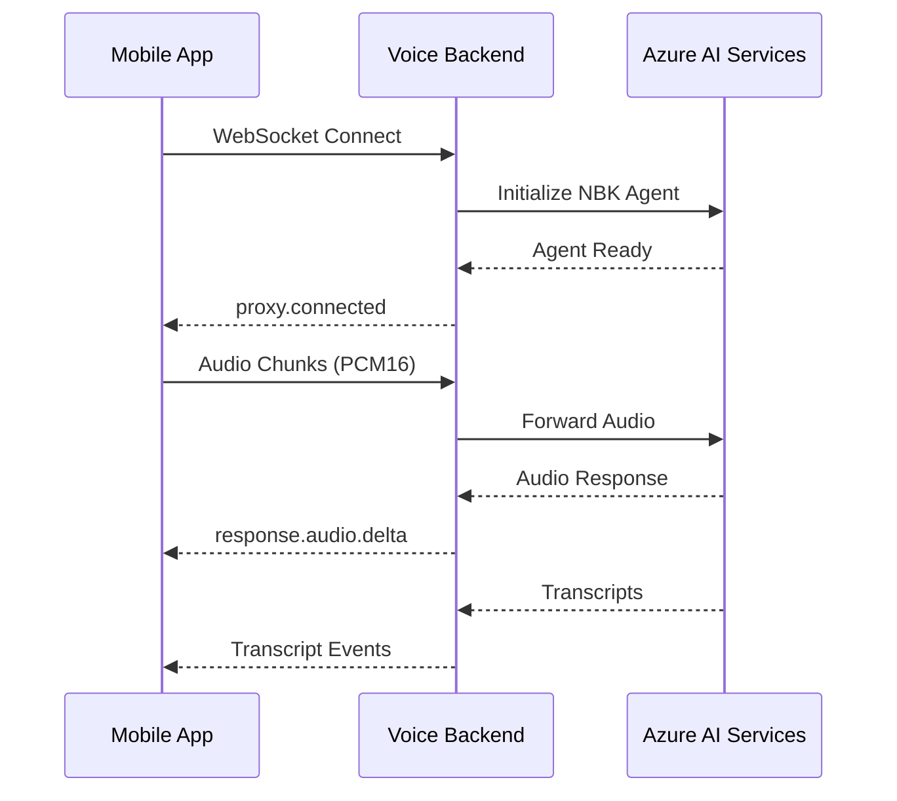

# NBK Banking Voice Backend - Mobile Integration Guide

## 🎯 Overview

This guide provides comprehensive instructions for mobile developers to integrate with the NBK Banking Voice Backend. The backend provides a WebSocket-based real-time voice conversation API powered by Azure AI services.

**Branch**: `mobile-backend-only`  
**Mode**: Backend-only deployment (no frontend)  
**Scenario**: Auto-initialized with NBK Banking customer service

---

## 📋 Quick Start

### 1. Deploy Backend to Azure

```bash
cd voicelive-api-salescoach
git checkout mobile-backend-only
azd auth login
azd up
```

### 2. Create Azure AI Foundry Agent

1. Go to [Azure AI Foundry Portal](https://ai.azure.com)
2. Select your AI Services resource
3. Navigate to **Agents** → **Create Agent**
4. Configure with these instructions:

```text
CRITICAL INTERACTION GUIDELINES FOR NBK BANKING CUSTOMER SERVICE:
- You are a helpful and professional NBK (National Bank of Kuwait) customer service representative
- Keep responses SHORT and conversational (3-4 sentences max, as if speaking on phone)
- Provide accurate information about NBK banking services, products, and policies
- Be courteous, patient, and empathetic with customers
- Use natural speech patterns appropriate for customer service
- Always prioritize customer security and privacy
- If you don't know specific account details, guide customers to secure channels
- Speak naturally in either Arabic or English based on customer's language preference
- For Arabic speakers, use clear Modern Standard Arabic that's accessible to Kuwaiti dialect speakers
- Show genuine care and professionalism in every interaction
- Use the Bing Custom Search tool to find accurate, up-to-date information from NBK's official website
- Always cite sources when providing information from NBK website
- If information is not available, politely acknowledge and direct customer to appropriate NBK channels
```

5. **Copy the Agent ID** (format: `asst_xxxxxxxxxxxxxxxxxxxxx`)

### 3. Configure Container App with Agent ID

**PowerShell:**
```powershell
$APP_NAME = azd env get-value AZURE_CONTAINER_APP_NAME
$RESOURCE_GROUP = "rg-$(azd env get-value AZURE_ENV_NAME)"
$AGENT_ID = "asst_xxxxxxxxxxxxx"  # Replace with your actual Agent ID

az containerapp update --name $APP_NAME --resource-group $RESOURCE_GROUP --set-env-vars "AGENT_ID=$AGENT_ID" "USE_AZURE_AI_AGENTS=true"
```

**Bash:**
```bash
APP_NAME=$(azd env get-value AZURE_CONTAINER_APP_NAME)
RESOURCE_GROUP="rg-$(azd env get-value AZURE_ENV_NAME)"
AGENT_ID="asst_xxxxxxxxxxxxx"  # Replace with your actual Agent ID

az containerapp update --name $APP_NAME --resource-group $RESOURCE_GROUP --set-env-vars "AGENT_ID=$AGENT_ID" "USE_AZURE_AI_AGENTS=true"
```

### 4. Get Your WebSocket Endpoint

After deployment completes:

```bash
# Get the backend URL
azd env get-value SERVICE_VOICELAB_URI
```

Your WebSocket endpoint will be:
```
wss://<your-backend-url>/ws/voice
```

Example: `wss://voicelab.something.azurecontainerapps.io/ws/voice`

---

## 🔌 WebSocket API Reference

### Connection

**Endpoint**: `wss://<your-backend-url>/ws/voice`  
**Protocol**: WebSocket  
**Auto-initialization**: Yes (NBK Banking scenario loads automatically)

### Connection Flow



### Message Types

#### **1. Connection Confirmation**
**Direction**: Backend → Mobile  
**Type**: `proxy.connected`

Sent immediately after successful WebSocket connection.

```json
{
  "type": "proxy.connected",
  "message": "Connected to Azure Voice API"
}
```

#### **2. Input Audio**
**Direction**: Mobile → Backend  
**Type**: `input_audio_buffer.append`

Send audio chunks from microphone in real-time.

```json
{
  "type": "input_audio_buffer.append",
  "audio": "<base64-encoded-pcm16-audio>"
}
```

**Audio Requirements**:
- Format: PCM16 (16-bit linear PCM)
- Sample Rate: 24000 Hz (24 kHz)
- Channels: Mono
- Encoding: Base64-encoded binary data

#### **3. Commit Audio Buffer**
**Direction**: Mobile → Backend  
**Type**: `input_audio_buffer.commit`

Signal end of user's speech turn.

```json
{
  "type": "input_audio_buffer.commit"
}
```

#### **4. Audio Response (Delta)**
**Direction**: Backend → Mobile  
**Type**: `response.audio.delta`

Real-time audio chunks from AI assistant.

```json
{
  "type": "response.audio.delta",
  "delta": "<base64-encoded-pcm16-audio>",
  "response_id": "resp_xxx",
  "item_id": "item_xxx",
  "output_index": 0,
  "content_index": 0
}
```

**Action**: Decode base64, convert to audio, and play immediately.

#### **5. User Transcript**
**Direction**: Backend → Mobile  
**Type**: `conversation.item.input_audio_transcription.completed`

Transcript of what the user said.

```json
{
  "type": "conversation.item.input_audio_transcription.completed",
  "item_id": "item_xxx",
  "transcript": "I would like to know about savings accounts"
}
```

#### **6. Assistant Transcript**
**Direction**: Backend → Mobile  
**Type**: `response.audio_transcript.done`

Transcript of what the AI assistant said.

```json
{
  "type": "response.audio_transcript.done",
  "response_id": "resp_xxx",
  "item_id": "item_xxx",
  "output_index": 0,
  "content_index": 0,
  "transcript": "I'd be happy to help you learn about NBK's savings accounts..."
}
```

#### **7. Error**
**Direction**: Backend → Mobile  
**Type**: `error`

Error notifications from backend.

```json
{
  "type": "error",
  "error": {
    "message": "Error description"
  }
}
```

---

## 📱 Mobile Implementation Guide

### iOS (Swift) Example

```swift
import Foundation
import AVFoundation

class NBKVoiceClient {
    private var webSocket: URLSessionWebSocketTask?
    private var audioEngine: AVAudioEngine?
    private var audioPlayer: AVAudioPlayerNode?
    
    func connect(endpoint: String) {
        let url = URL(string: endpoint)!
        webSocket = URLSession.shared.webSocketTask(with: url)
        webSocket?.resume()
        
        // Start listening for messages
        receiveMessage()
    }
    
    func startRecording() {
        audioEngine = AVAudioEngine()
        let inputNode = audioEngine!.inputNode
        let format = inputNode.outputFormat(forBus: 0)
        
        inputNode.installTap(onBus: 0, bufferSize: 4096, format: format) { buffer, _ in
            self.sendAudioChunk(buffer: buffer)
        }
        
        try? audioEngine?.start()
    }
    
    func sendAudioChunk(buffer: AVAudioPCMBuffer) {
        // Convert to PCM16 24kHz and base64 encode
        let audioData = convertToPCM16(buffer: buffer)
        let base64Audio = audioData.base64EncodedString()
        
        let message: [String: Any] = [
            "type": "input_audio_buffer.append",
            "audio": base64Audio
        ]
        
        let jsonData = try! JSONSerialization.data(withJSONObject: message)
        let jsonString = String(data: jsonData, encoding: .utf8)!
        
        webSocket?.send(.string(jsonString)) { error in
            if let error = error {
                print("Send error: \(error)")
            }
        }
    }
    
    func stopRecording() {
        audioEngine?.stop()
        
        // Commit the audio buffer
        let message: [String: String] = ["type": "input_audio_buffer.commit"]
        let jsonData = try! JSONSerialization.data(withJSONObject: message)
        let jsonString = String(data: jsonData, encoding: .utf8)!
        
        webSocket?.send(.string(jsonString)) { _ in }
    }
    
    private func receiveMessage() {
        webSocket?.receive { [weak self] result in
            switch result {
            case .success(let message):
                switch message {
                case .string(let text):
                    self?.handleMessage(text: text)
                case .data(let data):
                    break
                @unknown default:
                    break
                }
                self?.receiveMessage() // Continue listening
            case .failure(let error):
                print("Receive error: \(error)")
            }
        }
    }
    
    private func handleMessage(text: String) {
        guard let data = text.data(using: .utf8),
              let json = try? JSONSerialization.jsonObject(with: data) as? [String: Any],
              let type = json["type"] as? String else {
            return
        }
        
        switch type {
        case "proxy.connected":
            print("✅ Connected to NBK Banking Voice Backend")
            
        case "response.audio.delta":
            if let base64Audio = json["delta"] as? String {
                playAudioDelta(base64Audio: base64Audio)
            }
            
        case "conversation.item.input_audio_transcription.completed":
            if let transcript = json["transcript"] as? String {
                print("User said: \(transcript)")
            }
            
        case "response.audio_transcript.done":
            if let transcript = json["transcript"] as? String {
                print("Assistant said: \(transcript)")
            }
            
        case "error":
            if let error = json["error"] as? [String: Any],
               let message = error["message"] as? String {
                print("❌ Error: \(message)")
            }
            
        default:
            break
        }
    }
    
    private func playAudioDelta(base64Audio: String) {
        // Decode base64 and play audio
        guard let audioData = Data(base64Encoded: base64Audio) else { return }
        
        // Convert PCM16 data to playable audio and queue for playback
        // Implementation depends on your audio playback setup
    }
    
    private func convertToPCM16(buffer: AVAudioPCMBuffer) -> Data {
        // Convert AVAudioPCMBuffer to PCM16 format at 24kHz
        // Implementation depends on your audio processing setup
        return Data()
    }
}
```

### Android (Kotlin) Example

```kotlin
import okhttp3.*
import okio.ByteString
import org.json.JSONObject
import java.util.concurrent.TimeUnit

class NBKVoiceClient {
    private var webSocket: WebSocket? = null
    private val client = OkHttpClient.Builder()
        .pingInterval(30, TimeUnit.SECONDS)
        .build()
    
    fun connect(endpoint: String) {
        val request = Request.Builder()
            .url(endpoint)
            .build()
        
        webSocket = client.newWebSocket(request, object : WebSocketListener() {
            override fun onOpen(webSocket: WebSocket, response: Response) {
                println("✅ WebSocket Connected")
            }
            
            override fun onMessage(webSocket: WebSocket, text: String) {
                handleMessage(text)
            }
            
            override fun onFailure(webSocket: WebSocket, t: Throwable, response: Response?) {
                println("❌ WebSocket Error: ${t.message}")
            }
        })
    }
    
    fun sendAudioChunk(audioData: ByteArray) {
        val base64Audio = android.util.Base64.encodeToString(
            audioData, 
            android.util.Base64.NO_WRAP
        )
        
        val message = JSONObject().apply {
            put("type", "input_audio_buffer.append")
            put("audio", base64Audio)
        }
        
        webSocket?.send(message.toString())
    }
    
    fun commitAudio() {
        val message = JSONObject().apply {
            put("type", "input_audio_buffer.commit")
        }
        
        webSocket?.send(message.toString())
    }
    
    private fun handleMessage(text: String) {
        val json = JSONObject(text)
        val type = json.getString("type")
        
        when (type) {
            "proxy.connected" -> {
                println("✅ Connected to NBK Banking Voice Backend")
            }
            
            "response.audio.delta" -> {
                val base64Audio = json.getString("delta")
                playAudioDelta(base64Audio)
            }
            
            "conversation.item.input_audio_transcription.completed" -> {
                val transcript = json.getString("transcript")
                println("User said: $transcript")
            }
            
            "response.audio_transcript.done" -> {
                val transcript = json.getString("transcript")
                println("Assistant said: $transcript")
            }
            
            "error" -> {
                val error = json.getJSONObject("error")
                val message = error.getString("message")
                println("❌ Error: $message")
            }
        }
    }
    
    private fun playAudioDelta(base64Audio: String) {
        val audioData = android.util.Base64.decode(base64Audio, android.util.Base64.NO_WRAP)
        // Queue audio data for playback
        // Implementation depends on your audio playback setup
    }
    
    fun disconnect() {
        webSocket?.close(1000, "Client closing")
    }
}
```

---

## 🎙️ Audio Specifications

### Input Audio (Microphone)

| Property | Value |
|----------|-------|
| Format | PCM16 (Linear 16-bit) |
| Sample Rate | 24000 Hz (24 kHz) |
| Channels | Mono |
| Bit Depth | 16-bit |
| Encoding | Base64 (for WebSocket transmission) |
| Chunk Size | Recommended 100-200ms chunks |

### Output Audio (Speaker)

| Property | Value |
|----------|-------|
| Format | PCM16 (Linear 16-bit) |
| Sample Rate | 24000 Hz (24 kHz) |
| Channels | Mono |
| Bit Depth | 16-bit |
| Encoding | Base64 (received via WebSocket) |
| Latency | ~100-300ms |

---

## 🎨 UI/UX Recommendations

### Push-to-Talk Button

Recommended implementation:

1. **Button States**:
   - **Idle**: "Tap to speak"
   - **Listening**: Animated microphone icon + "Listening..."
   - **Processing**: Spinner + "Processing..."
   - **Speaking**: Speaker icon + "Speaking..."

2. **User Flow**:
   ```
   User taps button → Start recording → Stream audio
   User releases → Stop recording → Commit audio → Wait for response
   Response arrives → Play audio → Return to idle
   ```

### Visual Feedback

- Show real-time transcripts in chat-style bubbles
- Display connection status indicator
- Show audio level meter while recording
- Provide clear error messages for connectivity issues

### Language Support

The backend supports both **English** and **Arabic**:
- Auto-detects user's language
- Responds in the same language
- No manual language selection needed

---

## 🧪 Testing

### Test WebSocket Connection

Use `wscat` (Node.js) or any WebSocket client:

```bash
# Install wscat
npm install -g wscat

# Connect to your endpoint
wscat -c "wss://your-backend-url/ws/voice"

# You should receive:
# {"type":"proxy.connected","message":"Connected to Azure Voice API"}
```

### Health Check Endpoint

```bash
curl https://your-backend-url/api/health
```

Expected response:
```json
{
  "status": "healthy",
  "service": "NBK Banking Voice Backend",
  "websocket_endpoint": "/ws/voice"
}
```

### Configuration Endpoint

```bash
curl https://your-backend-url/api/config
```

Expected response:
```json
{
  "proxy_enabled": true,
  "ws_endpoint": "/ws/voice",
  "mode": "mobile_backend",
  "scenario": "nbk-banking"
}
```

---

## 🔒 Security Considerations

1. **Always use WSS (Secure WebSocket)** - Never use `ws://` in production
2. **No sensitive data** - Never send account numbers, passwords, or PINs
3. **Session management** - Implement proper session timeouts
4. **Error handling** - Don't expose internal errors to users
5. **Rate limiting** - Consider implementing client-side throttling

---

## 🐛 Troubleshooting

### Connection Issues

**Problem**: WebSocket connection fails  
**Solution**: 
- Verify endpoint URL is correct
- Check network connectivity
- Ensure WSS (not WS) is used
- Check Azure Container App is running

### No Audio Response

**Problem**: Not receiving `response.audio.delta`  
**Solution**:
- Verify audio format is PCM16 24kHz
- Ensure `input_audio_buffer.commit` was sent
- Check WebSocket is still connected
- Review backend logs for errors

### Transcript Not Showing

**Problem**: Missing transcript events  
**Solution**:
- Audio might be too short or unclear
- Check microphone permissions
- Verify audio is being sent correctly
- Ensure sufficient audio quality

### Agent Not Responding

**Problem**: Connection works but no AI responses  
**Solution**:
- Verify `AGENT_ID` is set in Azure Container App
- Check `USE_AZURE_AI_AGENTS` is set to `true`
- Confirm agent exists in Azure AI Foundry
- Review Container App logs

---

## 📞 Support & Feedback

For questions or issues:
1. Check Container App logs in Azure Portal
2. Review this integration guide
3. Contact backend team with:
   - WebSocket endpoint URL
   - Error messages
   - Sample message payloads
   - Expected vs actual behavior

---

## 📚 Additional Resources

- [Azure AI Voice Services Documentation](https://learn.microsoft.com/azure/ai-services/speech-service/)
- [WebSocket Protocol RFC 6455](https://datatracker.ietf.org/doc/html/rfc6455)
- [PCM Audio Format Guide](https://en.wikipedia.org/wiki/Pulse-code_modulation)

---

**Happy Building! 🚀**
