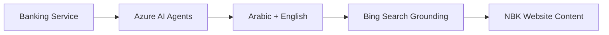

# NBK Banking Avatar Transformation - Summary

## Date: November 5, 2025

## Overview

Successfully transformed the Voice Live API Sales Coach application into a **bilingual NBK Banking Customer Service Avatar** with the following capabilities:

### ✅ Key Changes Implemented

#### 1. **Azure AI Foundry Agent Service Integration**
- **Enabled**: Set `useFoundryAgents: true` in `infra/main.parameters.json`
- **Agent Mode**: Switched from local YAML prompts to Azure AI Agent Service
- **Benefits**: Centralized agent management, better scaling, tool integration

#### 2. **Bing Custom Search Grounding**
- **Resource Added**: `Microsoft.Bing/accounts` (BingGroundingCustomSearch) in `infra/resources.bicep`
- **Purpose**: Ground agent responses on NBK website content
- **Domains**: Configured to search:
  - `https://www.nbk.com/kuwait` (main Kuwait site)
  - `https://www.nbk.com/kuwait/personal/cards/credit-cards.html` (credit cards)
  - `https://www.nbk.com/kuwait/investments/nbk-invest-app/guided-investments.html` (investments)
- **Integration**: Agent configured to use Bing tool for accurate, cited information
- **Configuration**: Requires post-deployment setup of Configuration Instance in Azure Portal

#### 3. **Bilingual Support (Arabic + English)**
- **Primary Language**: Arabic (`ar-SA`) - Modern Standard Arabic
- **Primary Voice**: `ar-SA-ZariyahNeural` (female, suitable for Kuwaiti customers)
- **Secondary**: Full English support with automatic language detection
- **Voice Quality**: Neural voices for natural, human-like speech
- **Alternative Voices**:
  - Arabic: `ar-SA-HamedNeural` (male)
  - English: `en-US-AvaMultilingualNeural`, `en-US-Ava:DragonHDLatestNeural`

#### 4. **Banking Customer Service Agent**
- **New Scenario**: Created `nbk-banking-role-play.prompt.yml`
- **Role**: Professional NBK customer service representative
- **Capabilities**:
  - Account inquiries (savings, current, salary)
  - Card information (credit, debit)
  - Loan and financing details
  - Investment and wealth management
  - Digital banking support (app, online)
  - Branch locations and hours
  - General banking procedures
- **Security**: Never asks for sensitive credentials
- **Grounding**: Uses Bing Search to cite NBK official website

#### 5. **Infrastructure Updates**

**File: `infra/resources.bicep`**
- Added Bing Grounding with Custom Search resource
- Added secrets for Bing API key
- Added environment variables for voice configuration
- Updated to use Arabic voice by default
- Added outputs for Bing resource information

**File: `infra/main.parameters.json`**
- Changed `useFoundryAgents` from `false` to `true`

#### 6. **Backend Configuration Updates**

**File: `backend/src/config.py`**
- Changed default language to `ar-SA` (Arabic)
- Changed default voice to `ar-SA-ZariyahNeural`
- Added Bing Grounding configuration parameters:
  - `bing_grounding_resource_key`
  - `bing_grounding_resource_name`
  - `bing_grounding_config_id`

**File: `backend/src/services/managers.py`**
- Updated `BASE_INSTRUCTIONS` for NBK banking context
- Modified `_create_azure_agent()` to include Bing Custom Search tool
- Added Bing tool configuration with proper connection and config ID
- Enhanced logging for agent creation with grounding

#### 7. **Documentation**

**File: `README.md`**
- Completely rewritten for NBK Banking Avatar use case
- Updated title, description, and features
- Added bilingual support information
- Documented Bing Custom Search configuration steps

**File: `DEPLOYMENT-GUIDE.md`** (New)
- Comprehensive deployment instructions
- Bing Custom Search setup walkthrough
- Language configuration guide
- Troubleshooting section
- Security considerations
- Cost optimization tips

**File: `data/scenarios/nbk-banking-role-play.prompt.yml`** (New)
- Banking-specific agent prompt
- Bilingual instructions
- NBK service coverage
- Security guidelines
- Professional customer service tone

---

## Deployment Flow

### Before Deployment


### After Transformation


---

## Architecture Changes

### Previous Architecture
```
Client → Flask → Voice Live API → GPT-4o (Local Prompts)
```

### New Architecture
```
Client → Flask → Voice Live API → Azure AI Agent → GPT-4o + Bing Grounding
                                                    ↓
                                            NBK Website Content
```

---

## Key Features

### 🌐 Bilingual Support
- **Arabic**: Default language with `ar-SA-ZariyahNeural` voice
- **English**: Full support with automatic detection
- **Dialect Friendly**: Modern Standard Arabic accessible to Kuwaiti speakers

### 🔍 Grounded Responses
- Searches NBK official website
- Provides cited, accurate information
- Up-to-date content (not limited to training data)

### 🏦 Banking Expertise
- Account information
- Card services
- Loans and financing
- Investment products
- Digital banking
- Branch locations

### 🔒 Security First
- Never requests sensitive credentials
- Directs to secure channels for account-specific needs
- Compliant with banking security standards

---

## Post-Deployment Steps Required

1. **Configure Bing Custom Search Instance**
   - Go to Azure Portal → Bing Grounding resource
   - Create configuration with NBK domains
   - Note Configuration ID

2. **Set Environment Variable**
   ```bash
   azd env set BING_GROUNDING_CONFIG_ID <config-id>
   azd up
   ```

3. **Verify Agent Configuration**
   - Azure AI Foundry Portal → Agents
   - Check Bing tool is attached
   - Test with sample queries

---

## Testing Checklist

- [ ] Deploy infrastructure: `azd up`
- [ ] Configure Bing Search with NBK domains
- [ ] Set `BING_GROUNDING_CONFIG_ID` environment variable
- [ ] Redeploy with configuration
- [ ] Test Arabic conversation
- [ ] Test English conversation
- [ ] Verify Bing citations in responses
- [ ] Confirm banking context (not sales)
- [ ] Check security (no credential requests)

---

## Files Modified

### Infrastructure (3 files)
1. `infra/resources.bicep` - Added Bing resource, updated env vars
2. `infra/main.parameters.json` - Enabled Azure AI Agents
3. `azure.yaml` - (unchanged, uses remote builds)

### Backend (2 files)
1. `backend/src/config.py` - Arabic voice, Bing configuration
2. `backend/src/services/managers.py` - Banking instructions, Bing tool integration

### Frontend (1 file)
1. `README.md` - Updated for banking context

### New Files (2 files)
1. `data/scenarios/nbk-banking-role-play.prompt.yml` - Banking agent prompt
2. `DEPLOYMENT-GUIDE.md` - Comprehensive deployment guide

### Documentation (1 file)
1. `CHANGES.md` - (Previous ARM64 deployment fixes)

---

## Migration from Sales Coach to Banking Avatar

| Aspect | Before | After |
|--------|--------|-------|
| **Use Case** | Sales training | Banking customer service |
| **Language** | English only | Arabic + English |
| **Voice** | en-US-Ava | ar-SA-Zariyah |
| **Agent Mode** | Local YAML | Azure AI Agents |
| **Grounding** | None | Bing (NBK website) |
| **Domain** | Generic sales | NBK banking |
| **Security** | N/A | Banking compliance |

---

## Cost Implications

### New Azure Resources
- **Bing Grounding with Custom Search**: S1 SKU (~$X/month + per-query charges)
  - Billed per agent tool call
  - Monitor usage in Azure Portal

### Existing Resources (Unchanged)
- Azure AI Foundry (GPT-4o)
- Azure Speech Services
- Container Apps
- Application Insights

### Cost Optimization
- Use `gpt-4o-mini` for development
- Monitor Bing tool call frequency
- Set up budget alerts in Azure

---

## Next Steps

1. **Deploy**: Run `azd up` to deploy infrastructure
2. **Configure Bing**: Set up NBK domain configuration
3. **Test**: Verify bilingual banking conversations
4. **Customize**: Adjust agent prompts for specific NBK needs
5. **Monitor**: Track usage and costs
6. **Secure**: Enable private endpoints for production

---

## Support Resources

- **Azure AI Foundry Agents**: https://learn.microsoft.com/azure/ai-foundry/agents/
- **Bing Custom Search**: https://learn.microsoft.com/azure/ai-foundry/agents/how-to/tools/bing-custom-search
- **Azure Speech (Arabic)**: https://learn.microsoft.com/azure/ai-services/speech-service/language-support
- **Voice Live API**: Azure AI Foundry documentation

---

## Important Notes

⚠️ **Bing Custom Search Requirements**:
- NBK website must be publicly accessible
- Domains must be indexed by Bing (may take 24-48 hours)
- Configuration ID required for agent to function

⚠️ **Arabic Voice Availability**:
- `ar-SA-ZariyahNeural` available in most Azure regions
- Verify Speech Services support in your deployment region
- Alternative: `ar-SA-HamedNeural` (male voice)

⚠️ **Agent Service**:
- Must enable `USE_AZURE_AI_AGENTS=true`
- Requires AI Foundry project endpoint
- Agent created dynamically on first conversation

---

**Status**: ✅ Ready for deployment with post-deployment Bing configuration required
**Tested**: 🟡 Code changes completed, deployment testing pending
**Production Ready**: 🟡 After Bing configuration and testing
