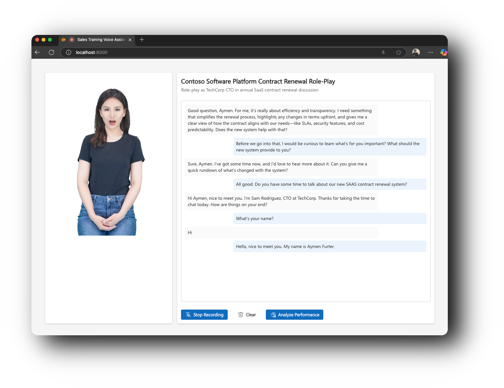
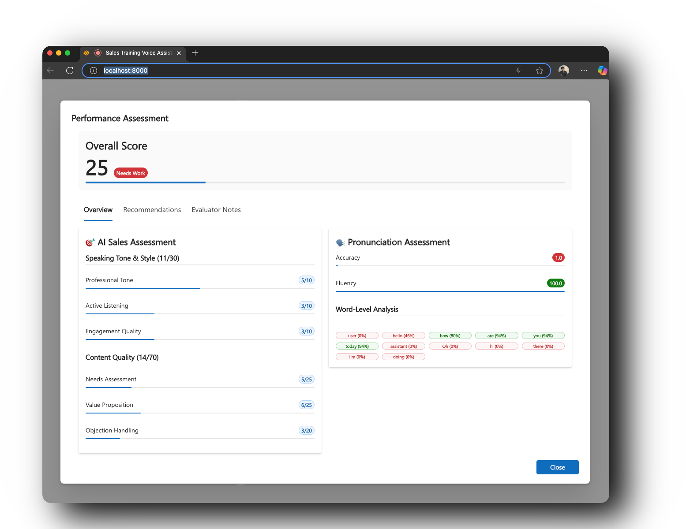
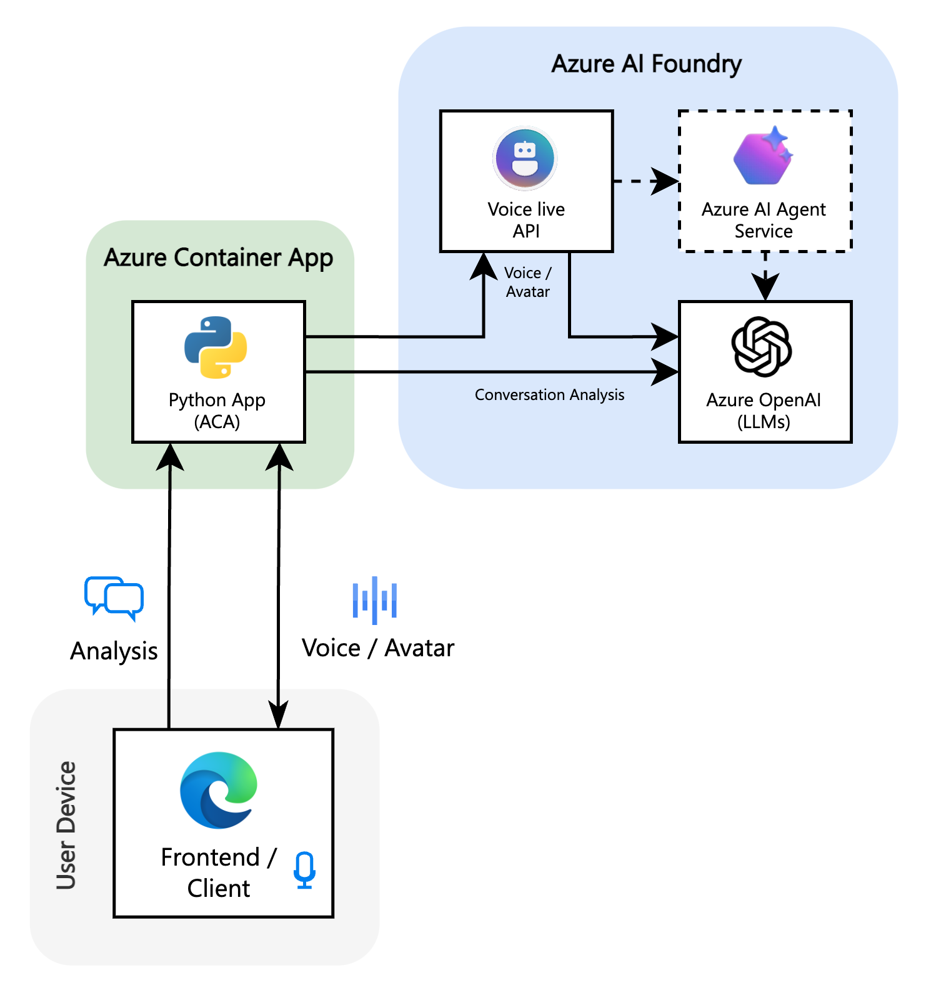

<!--
---
name: NBK Banking Customer Service Avatar (Python + React)
description: A bilingual AI-powered banking customer service avatar for National Bank of Kuwait using Azure Voice Live API and Azure AI services.
languages:
- python
- typescript
- bicep
- azdeveloper
products:
- azure-openai
- azure-ai-foundry
- azure-speech
- azure
page_type: sample
urlFragment: nbk-banking-avatar
---
-->
<p align="center">
   <h1 align="center">NBK Banking Customer Service Avatar</h1>
</p>
<p align="center">A bilingual (Arabic/English) AI-powered banking customer service avatar for National Bank of Kuwait, built on Azure.</p>
<p align="center">
   <a href="https://github.com/Azure-Samples/voicelive-api-salescoach/blob/main/LICENSE.md"></a>
   <a href="https://github.com/Azure-Samples/voicelive-api-salescoach/actions/workflows/lint-and-test.yml"></a>&nbsp;
   <a href="https://portal.azure.com/#create/Microsoft.Template/uri/https%3A%2F%2Fraw.githubusercontent.com%2FAzure-Samples%2Fvoicelive-api-salescoach%2Frefs%2Fheads%2Fmain%2Finfra%2Fdeployment.json"></a>&nbsp;
</p>



---

## Overview

NBK Banking Customer Service Avatar is an AI-powered virtual assistant for National Bank of Kuwait customers. Using Azure AI services and Bing Custom Search grounding, it provides accurate information about NBK's banking services and products through natural voice conversations in both Arabic and English.

### Features

- **Bilingual Voice Conversations** - Interact naturally in Arabic (Kuwaiti-friendly dialect) or English using Azure Voice Live API
- **Grounded on NBK Website** - Uses Bing Custom Search to provide accurate, up-to-date information from NBK's official website
- **Real-time Voice Assistant** - Natural conversation flow with Azure Speech Services
- **Professional Banking Support** - Assists with inquiries about accounts, cards, loans, investments, and digital banking
- **Secure by Design** - Never asks for sensitive credentials, guides customers to secure channels for account-specific needs



## Demo

See the NBK Banking Avatar in action:

https://github.com/user-attachments/assets/904f1555-6981-4780-ae64-c5757337bcad

### How It Works

1. **Start Conversation** - Click the microphone to begin speaking with the NBK banking avatar
2. **Ask Questions** - Inquire about NBK services in Arabic or English
3. **Get Accurate Information** - The avatar searches NBK's website and provides grounded responses
4. **Natural Interaction** - Experience human-like conversation with professional banking support

## Getting Started

### Deploy to Azure

> **⚠️ IMPORTANT:** You must create Azure AI resources FIRST before running `azd up`.

**Prerequisites (Complete BEFORE `azd up`):**

1. **Create Azure Resources** using Azure CLI:
   - Azure AI Foundry (Cognitive Services multi-service)
   - Deploy GPT-4o model in AI Foundry Portal
   - Azure Speech Service
   - (Optional) Bing Custom Search

2. **Create Azure AI Agent** in AI Foundry Portal:
   - Configure with NBK customer service instructions (see below)
   - Copy the Agent ID (format: `asst_xxxxxxxxxxxxxxxxxxxxx`)

3. **Set Environment Variables** using `azd env set`:
   - Configure all 20+ variables (AI endpoints, Agent ID, Speech region, etc.)

**Deployment Steps:**

1. **Initialize and Deploy**:
   ```bash
   cd voicelive-api-salescoach
   azd init
   azd up
   ```

2. **Manual Container App Configuration (REQUIRED)**:
   After `azd up` completes, you must manually configure environment variables:
   ```bash
   # Get Container App name
   APP_NAME=$(azd env get-value AZURE_CONTAINER_APPS_NAME)
   RESOURCE_GROUP=<your-resource-group>
   
   # Add all environment variables (see deployment guide for complete command)
   az containerapp update --name $APP_NAME --resource-group $RESOURCE_GROUP --set-env-vars ...
   ```

3. **Verify Deployment**:
   - Test health endpoint: `https://<your-app-url>/api/config`
   - Open application in browser and test Avatar

**📖 Complete Instructions:**
- **[AZURE-DEPLOYMENT-GUIDE.md](./AZURE-DEPLOYMENT-GUIDE.md)** - Full step-by-step guide with all commands
- **[TROUBLESHOOTING.md](./TROUBLESHOOTING.md)** - Common issues and solutions

### Local Development

This project includes a dev container for easy setup and a build script for  development.

1. **Use Dev Container** (Recommended)
   - Open in VS Code and select "Reopen in Container" when prompted
   - All dependencies and tools are pre-configured

2. **Fill in the .env file**
   - Copy `.env.template` to `.env`
   - Fill in your Azure AI Foundry and Speech service keys and endpoints (you can run `azd provision` to create these resources if you haven't already)

3. **Build and run**
   ```bash
   # Build the application
   ./scripts/build.sh

   # Start the server
   cd backend && python src/app.py
   ```

Visit `http://localhost:8000` to start training!

## Architecture

<table>
<tr>
<td width="400">

</td>
<td>

The application leverages multiple Azure AI services to deliver real-time voice-based sales training:

- **Azure AI Foundry** - AI platform including:
  - Voice Live API for real-time speech-to-speech conversations and avatar simulation
  - Large language models (GPT-4o) as underlying LLM for performance analysis
  - Speech Services for post-conversation pronunciation and fluency assessment
  - Optional AI Agent Service
- **React + Fluent UI** - Modern web interface
- **Python Flask** - Backend API and WebSocket communication

**Conversation Flow:** User speech → Voice Live API → GPT-4o processing → AI agent response → Performance analysis → Detailed feedback

</td>
</tr>
</table>


## Contributors
<p float="left">
  <a href="https://github.com/aymenfurter"></a>
  <a href="https://github.com/curia-damiano"></a>
  <a href="https://github.com/TiffanyZ4Msft"></a>
</p>

## Contributing

This project welcomes contributions and suggestions. Most contributions require you to agree to a
Contributor License Agreement (CLA) declaring that you have the right to, and actually do, grant us
the rights to use your contribution. For details, visit https://cla.opensource.microsoft.com.

When you submit a pull request, a CLA bot will automatically determine whether you need to provide
a CLA and decorate the PR appropriately (e.g., status check, comment). Simply follow the instructions
provided by the bot. You will only need to do this once across all repos using our CLA.

This project has adopted the [Microsoft Open Source Code of Conduct](https://opensource.microsoft.com/codeofconduct/).
For more information see the [Code of Conduct FAQ](https://opensource.microsoft.com/codeofconduct/faq/) or
contact [opencode@microsoft.com](mailto:opencode@microsoft.com) with any additional questions or comments.

## Security

Microsoft takes the security of our software products and services seriously, which includes all source code repositories managed through our GitHub organizations, which include [Microsoft](https://github.com/Microsoft), [Azure](https://github.com/Azure), [DotNet](https://github.com/dotnet), [AspNet](https://github.com/aspnet) and [Xamarin](https://github.com/xamarin).

If you believe you have found a security vulnerability in any Microsoft-owned repository that meets [Microsoft's definition of a security vulnerability](https://aka.ms/security.md/definition), please report it to us as described in [SECURITY.md](SECURITY.md).

## Trademarks

This project may contain trademarks or logos for projects, products, or services. Authorized use of Microsoft
trademarks or logos is subject to and must follow
[Microsoft's Trademark & Brand Guidelines](https://www.microsoft.com/en-us/legal/intellectualproperty/trademarks/usage/general).
Use of Microsoft trademarks or logos in modified versions of this project must not cause confusion or imply Microsoft sponsorship.
Any use of third-party trademarks or logos are subject to those third-party's policies.
Any use of third-party trademarks or logos are subject to those third-party's policies.


<p align="center">
   <br/>
   <br/>
   Made with ❤️ in 🇨🇭
</p>
